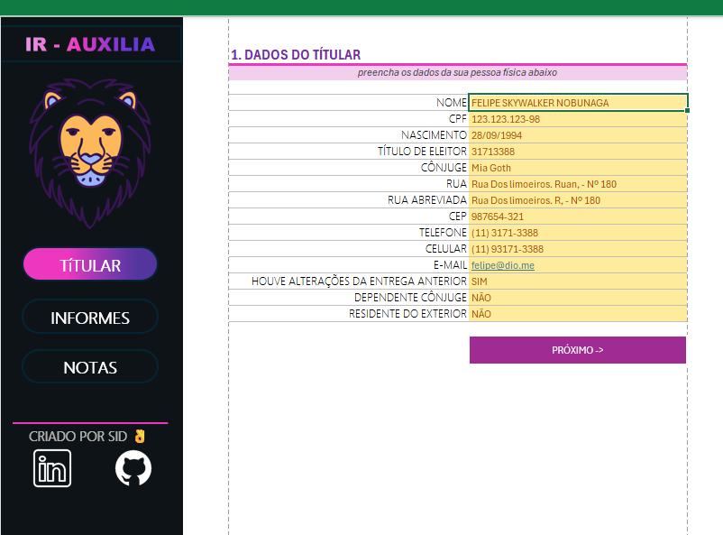
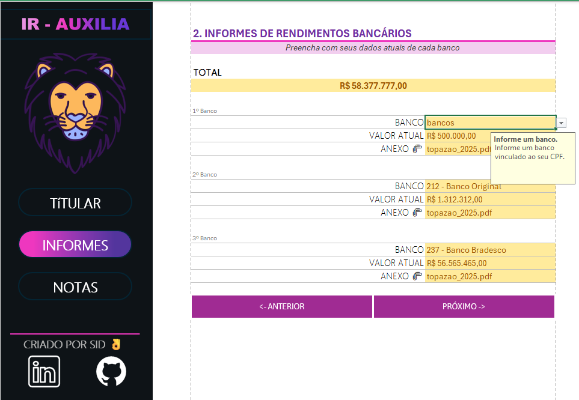
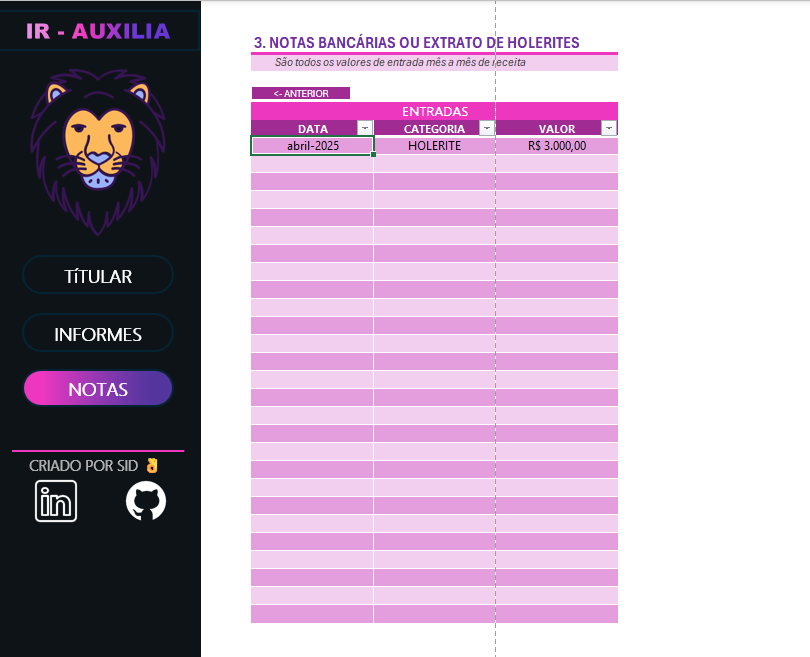

# 🚀 IR_AUXILIA: Seu Super-Herói da Declaração de Imposto de Renda! 🦸

Cansado de perder a cabeça com a declaração de Imposto de Renda? Seus problemas acabaram! Apresentamos o **IR_AUXILIA**, a ferramenta mágica em Excel que vai transformar a sua jornada fiscal de um pesadelo em um passeio no parque (ou quase isso!).

Desenvolvido para ser seu copiloto nessa aventura anual, o [IR_AUXILIA](https://github.com/sidmarb/IR_AUXILIA/blob/fd97a56381e0f48fdcba37aea6fa531398fed055/IR-AU.xlsx) é a solução perfeita para organizar e reunir todas aquelas informações cruciais que o Leão adora caçar. Prepare-se para dizer adeus à papelada espalhada e olá à tranquilidade de ter tudo no lugar certo!

## 🌟 Onde Tudo Começa: A Aba 'Titular' 🌟

Nesta aba, você é a estrela! Aqui, você insere todos os seus dados pessoais e as informações dos seus dependentes. Pense nela como a sua ficha de personagem em um jogo de RPG, mas em vez de salvar o mundo, você está salvando a sua paz de espírito na hora de declarar o IR. Mantenha tudo atualizado e evite dores de cabeça futuras!

## 📊 Informes: O Coração da Sua Declaração 💖

Aqui é onde a mágica acontece! A aba 'Informes' é o seu centro de comando para registrar todos os rendimentos, pagamentos, bens e dívidas. Imagine que cada linha é um pedacinho do seu quebra-cabeça fiscal. Preencha com carinho e atenção, e veja a sua declaração se montar quase sozinha. Chega de procurar informe por informe, agora está tudo centralizado e pronto para ser lançado no programa da Receita!

## 📝 Notas: Seu Diário de Bordo Fiscal 🚀

Sabe aquela informação importante que você não quer esquecer? Ou aquele lembrete crucial para o próximo ano? A aba 'Notas' é o seu espaço para isso! Use-a como um diário de bordo fiscal, anotando detalhes, observações e qualquer coisa que possa te ajudar a desvendar os mistérios do IR. Pequenas anotações podem fazer uma grande diferença na hora H!

## ✨ Por Que Usar o IR_AUXILIA? ✨

*   **Organização Total:** Diga adeus à bagunça e tenha todas as informações em um só lugar.
*   **Economia de Tempo:** Agilize o preenchimento da sua declaração com dados pré-organizados.
*   **Redução de Erros:** Minimize a chance de cair na malha fina com um controle mais eficiente.
*   **Paz de Espírito:** Tenha a tranquilidade de saber que você está preparado para o Leão!

## 🤝 Contribua com o Projeto! 🤝

Este projeto é um esforço para simplificar a vida de todos na hora de declarar o Imposto de Renda. Se você tem ideias, sugestões ou quer aprimorar o [IR_AUXILIA](https://github.com/sidmarb/IR_AUXILIA/blob/fd97a56381e0f48fdcba37aea6fa531398fed055/IR-AU.xlsx), sinta-se à vontade para contribuir! Faça um fork, mande um pull request e vamos juntos tornar a declaração de IR menos assustadora para todos!

